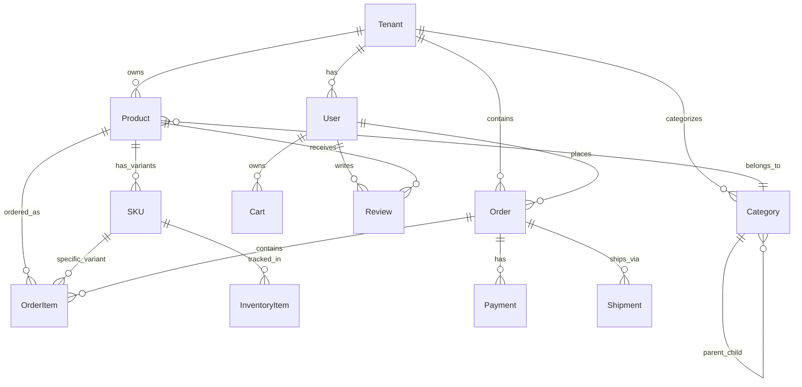

# Tài liệu Kiến trúc Kỹ thuật (TAD)

## Nền tảng E-commerce Multi-tenant

---

### Thông tin tài liệu

**Phiên bản**: 1.0  
**Ngày**: 22 tháng 1, 2026  
**Tác giả**: Đội ngũ Phát triển  
**Trạng thái**: Bản nháp

---

### Tổng quan Kiến trúc Hệ thống

#### Kiến trúc Cấp cao

```
┌─────────────────────────────────────────────────────────────────┐
│                        Load Balancer                            │
│                    (AWS ALB / Nginx)                           │
└─────────────────────┬───────────────────────────────────────────┘
                      │
┌─────────────────────┴───────────────────────────────────────────┐
│                    CDN / Edge Network                           │
│                  (CloudFlare / AWS CloudFront)                  │
└─────────────────────┬───────────────────────────────────────────┘
                      │
    ┌─────────────────┼─────────────────┐
    │                 │                 │
┌───▼───┐         ┌───▼───┐         ┌───▼───┐
│ Web   │         │ API   │         │ Admin │
│ (Next │         │ (Nest │         │ (Next │
│  JS)  │         │  JS)  │         │  JS)  │
└───┬───┘         └───┬───┘         └───┬───┘
    │                 │                 │
    └─────────────────┼─────────────────┘
                      │
    ┌─────────────────┼─────────────────┐
    │                 │                 │
┌───▼───┐         ┌───▼───┐         ┌───▼───┐
│ Cache │         │ Queue │         │ Search│
│ (Redis│         │ (Bull │         │ (Open │
│ )     │         │  MQ)  │         │Search)│
└───┬───┘         └───┬───┘         └───┬───┘
    │                 │                 │
    └─────────────────┼─────────────────┘
                      │
              ┌───────▼───────┐
              │   Database    │
              │ (PostgreSQL   │
              │ + pgvector)   │
              └───────────────┘
```

#### Mô hình Kiến trúc Multi-Tenant

**Cơ sở dữ liệu chia sẻ, Schema chia sẻ** với sự cách ly tenant thông qua cột `tenantId`:

```
┌─────────────────────────────────────────────────────────────────┐
│                    PostgreSQL Database                          │
├─────────────────────────────────────────────────────────────────┤
│  Table: users                                                   │
│  ├─ id (PK)                                                    │
│  ├─ tenantId (FK) ← Cách ly Tenant                              │
│  ├─ email                                                      │
│  ├─ ...                                                        │
├─────────────────────────────────────────────────────────────────┤
│  Table: products                                                │
│  ├─ id (PK)                                                    │
│  ├─ tenantId (FK) ← Cách ly Tenant                              │
│  ├─ name                                                       │
│  ├─ ...                                                        │
└─────────────────────────────────────────────────────────────────┘
```

---

### Lý do lựa chọn Tech Stack

#### Backend Technology Stack

| Công nghệ      | Phiên bản | Mục đích           | Lý do lựa chọn                                                    |
| -------------- | --------- | ------------------ | ----------------------------------------------------------------- |
| **Node.js**    | 20+       | Môi trường Runtime | Hiệu suất cao, hệ sinh thái lớn, hỗ trợ tốt TypeScript            |
| **NestJS**     | 11        | Framework          | Kiến trúc cấp doanh nghiệp, dependency injection, tính module hóa |
| **TypeScript** | 5.0+      | Ngôn ngữ           | Type safety, trải nghiệm dev tốt hơn, dễ bảo trì                  |
| **Prisma**     | 6.2.1     | ORM                | Truy cập DB an toàn (type-safe), migrations, DX tuyệt vời         |
| **PostgreSQL** | 15+       | Cơ sở dữ liệu      | Tuân thủ ACID, hỗ trợ JSON, pgvector cho các tính năng AI         |
| **Redis**      | 7+        | Cache/Session      | Caching hiệu suất cao, lưu trữ session, hàng đợi công việc        |
| **BullMQ**     | Mới nhất  | Hàng đợi công việc | Xử lý background job tin cậy, dựa trên Redis                      |

#### Frontend Technology Stack

| Công nghệ       | Phiên bản | Mục đích      | Lý do lựa chọn                                                |
| --------------- | --------- | ------------- | ------------------------------------------------------------- |
| **Next.js**     | 16.1      | Framework     | Hỗ trợ SSR/SSG, API routes, hiệu suất tuyệt vời               |
| **React**       | 19.2      | Thư viện UI   | Kiến trúc dựa trên component, hệ sinh thái khổng lồ           |
| **TailwindCSS** | 4         | Styling       | Utility-first, hệ thống thiết kế nhất quán                    |
| **Zustand**     | 5         | Quản lý State | Nhẹ, thân thiện với TypeScript                                |
| **SWR**         | 2.3       | Data Fetching | Caching, revalidation, cập nhật lạc quan (optimistic updates) |
| **TypeScript**  | 5.0+      | Ngôn ngữ      | An toàn kiểu dữ liệu đồng bộ giữa frontend/backend            |

#### Hạ tầng & DevOps

| Công nghệ          | Mục đích         | Lý do lựa chọn                             |
| ------------------ | ---------------- | ------------------------------------------ |
| **Docker**         | Container hóa    | Đồng nhất môi trường, đóng gói triển khai  |
| **Docker Compose** | Phát triển Local | Điều phối đa dịch vụ (orchestration)       |
| **GitHub Actions** | CI/CD            | Tích hợp sẵn với kho mã nguồn              |
| **Render**         | Hosting          | Triển khai đơn giản, quản lý cơ sở dữ liệu |
| **Vercel**         | Frontend Hosting | Tối ưu cho Next.js, CDN toàn cầu           |
| **Neon**           | Cơ sở dữ liệu    | Serverless PostgreSQL, tự động mở rộng     |

---

### Sơ đồ Kiến trúc Hệ thống

#### 1. Kiến trúc Lớp Ứng dụng (Application Layer)

```
┌─────────────────────────────────────────────────────────────────┐
│                        Lớp Hiển thị (Presentation)             │
├─────────────────────────────────────────────────────────────────┤
│  ┌─────────────┐  ┌─────────────┐  ┌─────────────────────┐   │
│  │   Web App   │  │ Admin Panel │  │   Mobile App (PWA)   │   │
│  │  (Next.js)  │  │ (Next.js)   │  │    (Next.js PWA)     │   │
│  └─────────────┘  └─────────────┘  └─────────────────────┘   │
└─────────────────────┬───────────────────────────────────────────┘
                      │
┌─────────────────────▼───────────────────────────────────────────┐
│                       API Gateway                              │
│                   (NestJS + Express)                           │
├─────────────────────────────────────────────────────────────────┤
│  ┌─────────────┐  ┌─────────────┐  ┌─────────────────────┐   │
│  │   Hệ thống  │  │   Giới hạn  │  │      Xác thực       │   │
│  │   Bảo vệ    │  │   Tốc độ    │  │      (Zod)           │   │
│  └─────────────┘  └─────────────┘  └─────────────────────┘   │
└─────────────────────┬───────────────────────────────────────────┘
                      │
┌─────────────────────▼───────────────────────────────────────────┐
│                     Lớp Logic Nghiệp vụ                         │
├─────────────────────────────────────────────────────────────────┤
│  ┌─────────────┐  ┌─────────────┐  ┌─────────────────────┐   │
│  │   Lớp       │  │   Lớp       │  │      Mô hình        │   │
│  │   Dịch vụ   │  │  Kho lưu trữ│  │      Domain         │   │
│  └─────────────┘  └─────────────┘  └─────────────────────┘   │
└─────────────────────┬───────────────────────────────────────────┘
                      │
┌─────────────────────▼───────────────────────────────────────────┐
│                      Lớp Truy cập Dữ liệu                      │
├─────────────────────────────────────────────────────────────────┤
│  ┌─────────────┐  ┌─────────────┐  ┌─────────────────────┐   │
│  │   Prisma    │  │   Redis     │  │    Elasticsearch    │   │
│  │    ORM      │  │    Cache    │  │      Search         │   │
│  └─────────────┘  └─────────────┘  └─────────────────────┘   │
└─────────────────────────────────────────────────────────────────┘
```

#### 2. Cách ly Dữ liệu Multi-Tenant

```
┌─────────────────────────────────────────────────────────────────┐
│                    Lớp Ứng dụng                                 │
│                                                                 │
│  ┌─────────────────────────────────────────────────────────┐   │
│  │              Quản lý Ngữ cảnh Tenant                    │   │
│  │                                                         │   │
│  │  ┌─────────────┐  ┌─────────────┐  ┌─────────────┐    │   │
│  │  │ Nhận diện   │  │ Nhận diện   │  │ Nhận diện   │    │   │
│  │  │ Domain      │  │ Subdomain   │  │ Header      │    │   │
│  │  └─────────────┘  └─────────────┘  └─────────────┘    │   │
│  └─────────────────────────────────────────────────────────┘   │
└─────────────────────┬───────────────────────────────────────────┘
                      │
┌─────────────────────▼───────────────────────────────────────────┐
│                    Lớp Middleware                               │
│                                                                 │
│  ┌─────────────────────────────────────────────────────────┐   │
│  │              Middleware Cách ly Tenant                  │   │
│  │                                                         │   │
│  │  • Trích xuất tenantId từ request                       │   │
│  │  • Xác thực tenant tồn tại và đang hoạt động            │   │
│  │  • Thiết lập ngữ cảnh AsyncLocalStorage                │   │
│  │  • Áp dụng tenantId cho tất cả truy vấn DB              │   │
│  │  • **Bypass logic cho Super Admin** (nếu cần truy cập   │   │
│  │    xuyên tenant)                                        │   │
│  └─────────────────────────────────────────────────────────┘   │
└─────────────────────┬───────────────────────────────────────────┘
                      │
┌─────────────────────▼───────────────────────────────────────────┐
│                     Lớp Cơ sở Dữ liệu                          │
│                                                                 │
│  ┌─────────────────────────────────────────────────────────┐   │
│  │                Schema Cơ sở Dữ liệu Chia sẻ              │   │
│  │                                                         │   │
│  │  SELECT * FROM products WHERE tenantId = ? AND id = ?  │   │
│  │                                                         │   │
│  │  • Truy vấn tự động được lọc theo tenantId             │   │
│  │  • Bảo vệ bổ sung qua Row Level Security (RLS)         │   │
│  │  • Ghi nhật ký kiểm toán cho các nỗ lực truy cập chéo   │   │
│  └─────────────────────────────────────────────────────────┘   │
└─────────────────────────────────────────────────────────────────┘
```

#### 3. Kiến trúc Caching

```
┌─────────────────────────────────────────────────────────────────┐
│                        Ứng dụng                                 │
└─────────────────────┬───────────────────────────────────────────┘
                      │
┌─────────────────────▼───────────────────────────────────────────┐
│                    Quản lý Cache                               │
├─────────────────────────────────────────────────────────────────┤
│  ┌─────────────┐  ┌─────────────┐  ┌─────────────────────┐   │
│  │     L1      │  │     L2      │  │      CDN            │   │
│  │ (Trong bộ nhớ)│  │  (Redis)   │  │   (CloudFlare)     │   │
│  │             │  │             │  │                     │   │
│  │ • Request   │  │ • Session   │  │ • Tài sản tĩnh      │   │
│  │ • Response  │  │ • Database  │  │ • Phản hồi API      │   │
│  │ • 1-5 phút  │  │ • 1-24 giờ  │  │ • 1-7 ngày         │   │
│  └─────────────┘  └─────────────┘  └─────────────────────┘   │
└─────────────────────┬───────────────────────────────────────────┘
                      │
┌─────────────────────▼───────────────────────────────────────────┐
│                    Chiến lược Cache                            │
├─────────────────────────────────────────────────────────────────┤
│                                                                 │
│  • Cache-Aside: Database → Cache → Ứng dụng                    │
│  • Write-Through: Ứng dụng → Cache → Database                  │
│  • Write-Behind: Ứng dụng → Cache → Async → Database           │
│  • Cache Invalidation: TTL + Dựa trên sự kiện                  │
│                                                                 │
└─────────────────────────────────────────────────────────────────┘
```

---

### Thiết kế Schema Cơ sở Dữ liệu

#### Các Mối quan hệ Thực thể Chính



#### Các Pattern Thiết kế Chính

1. **Xóa mềm (Soft Delete)**: Tất cả thực thể đều có cột `deletedAt`
2. **Nhật ký Kiểm toán (Audit Trail)**: `createdAt`, `updatedAt`, `createdBy`, `updatedBy`
3. **Cách ly Tenant**: `tenantId` trên tất cả các bảng đặc thù của tenant
4. **Khóa lạc quan (Optimistic Locking)**: Cột `version` cho các cập nhật đồng thời
5. **Cột JSON**: Lưu trữ metadata linh hoạt bằng PostgreSQL JSONB

---

### Thông số API (OpenAPI/Swagger)

#### Cấu trúc API

```
/api/v1/
├── auth/
│   ├── POST /login
│   ├── POST /register
│   ├── POST /refresh
│   └── POST /logout
├── users/
│   ├── GET /profile
│   ├── PUT /profile
│   └── GET /:id
├── products/
│   ├── GET /
│   ├── GET /:id
│   ├── POST /
│   ├── PUT /:id
│   └── DELETE /:id
├── orders/
│   ├── GET /
│   ├── GET /:id
│   ├── POST /
│   └── PUT /:id/status
└── cart/
    ├── GET /
    ├── POST /items
    ├── PUT /items/:id
    └── DELETE /items/:id
```

#### Nguyên tắc Thiết kế API

1. **Thiết kế RESTful**: Các phương thức HTTP và mã trạng thái chuẩn
2. **Phân phiên bản (Versioning)**: Phân phiên bản dựa trên URL (`/api/v1/`)
3. **Phân trang**: `limit`, `offset`, `total` trong các phản hồi
4. **Lọc dữ liệu**: Tham số truy vấn cho lọc và sắp xếp
5. **Xử lý lỗi**: Định dạng phản hồi lỗi nhất quán
6. **Giới hạn tốc độ**: Giới hạn cho mỗi tenant và mỗi người dùng

#### Tiêu chuẩn Định dạng Phản hồi

```typescript
// Phản hồi Thành công
interface ApiResponse<T> {
  data: T;
  meta: {
    total?: number;
    page?: number;
    limit?: number;
  };
  links?: {
    self: string;
    next?: string;
    prev?: string;
  };
}

// Phản hồi Lỗi
interface ApiError {
  error: {
    code: string;
    message: string;
    details?: any;
    timestamp: string;
    path: string;
  };
}
```

---

### Kiến trúc Bảo mật

#### Vai trò & Phân quyền (Roles & Permissions)

- **Super Admin (Cấp Hệ thống)**:
  - Là chủ nền tảng (Platform Owner).
  - Có toàn quyền trên tất cả các Tenant.
  - Có khả năng bypass logic cách ly tenant để quản trị và kiểm toán.
  - Quản lý việc tạo, đình chỉ các Tenant.
- **Tenant Admin**: Quản trị viên của một cửa hàng/tenant cụ thể.
- **Store Manager/Staff**: Nhân viên cửa hàng với các quyền hạn hạn chế.
- **Customer**: Khách hàng mua sắm.

#### Luồng Xác thực & Phân quyền

```
┌─────────────────────────────────────────────────────────────────┐
│                    Luồng Xác thực                               │
└─────────────────────┬───────────────────────────────────────────┘
                      │
┌─────────────────────▼───────────────────────────────────────────┐
│                     Yêu cầu Đăng nhập                           │
│                                                                 │
│  POST /api/v1/auth/login                                       │
│  { email, password, tenantId }                                 │
└─────────────────────┬───────────────────────────────────────────┘
                      │
┌─────────────────────▼───────────────────────────────────────────┐
│                   Dịch vụ Xác thực                             │
│                                                                 │
│  1. Kiểm tra thông tin đăng nhập                               │
│  2. Kiểm tra trạng thái tenant                                  │
│  3. Tạo JWT + Refresh Token                                    │
│  4. Tạo session trong Redis                                     │
│  5. Ghi nhật ký sự kiện xác thực                               │
└─────────────────────┬───────────────────────────────────────────┘
                      │
┌─────────────────────▼───────────────────────────────────────────┐
│                     Phản hồi Token                              │
│                                                                 │
│  {                                                              │
│    accessToken: "jwt.token",                                    │
│    refreshToken: "refresh.token",                              │
│    expiresIn: 3600,                                            │
│    user: { id, email, role, permissions }                     │
│  }                                                              │
└─────────────────────────────────────────────────────────────────┘
```

#### Các Lớp Bảo mật

1. **Bảo mật Mạng**
   - TLS 1.3 cho tất cả giao tiếp
   - WAF (Web Application Firewall)
   - Chống tấn công DDoS
   - IP whitelisting cho truy cập admin

2. **Bảo mật Ứng dụng**
   - Xác thực đầu vào với Zod schemas
   - Ngăn chặn SQL injection (Prisma ORM)
   - Chống XSS (Content Security Policy)
   - Chống CSRF (SameSite cookies)

3. **Bảo mật Dữ liệu**
   - Mã hóa dữ liệu tĩnh (AES-256)
   - Mã hóa dữ liệu truyền tải (TLS)
   - Che giấu dữ liệu PII trong nhật ký
   - Kiểm toán bảo mật định kỳ

4. **Bảo mật Hạ tầng**
   - Quét bảo mật container
   - Quản lý bí mật (biến môi trường)
   - Phân đoạn mạng
   - Giám sát và ghi nhật ký truy cập

---

### Yêu cầu Hiệu suất

#### Mục tiêu Thời gian Phản hồi

| Loại Endpoint     | Mục tiêu (95th percentile) | Tối đa |
| ----------------- | -------------------------- | ------ |
| Xác thực          | <200ms                     | 500ms  |
| Tìm kiếm sản phẩm | <500ms                     | 1s     |
| Xử lý đơn hàng    | <1s                        | 2s     |
| Tải Dashboard     | <2s                        | 5s     |
| Tải tệp lên       | <5s                        | 10s    |

#### Kiến trúc Khả năng Mở rộng

```
┌─────────────────────────────────────────────────────────────────┐
│                      Load Balancer                             │
│                   (Mở rộng theo chiều ngang)                   │
└─────────────────────┬───────────────────────────────────────────┘
                      │
    ┌─────────────────┼─────────────────┐
    │                 │                 │
┌───▼───┐         ┌───▼───┐         ┌───▼───┐
│ API   │         │ API   │         │ API   │
│ Pod 1 │         │ Pod 2 │         │ Pod N │
└───┬───┘         └───┬───┘         └───┬───┘
    │                 │                 │
    └─────────────────┼─────────────────┘
                      │
┌─────────────────────▼───────────────────────────────────────────┐
│                    Cụm Cơ sở Dữ liệu                           │
│                   (Read Replicas)                              │
│                                                                 │
│  ┌─────────────┐  ┌─────────────┐  ┌─────────────────────┐   │
│  │   Primary   │  │  Replica 1  │  │     Replica N        │   │
│  │ (Ghi)       │  │  (Đọc)      │  │     (Đọc)            │   │
│  └─────────────┘  └─────────────┘  └─────────────────────┘   │
└─────────────────────────────────────────────────────────────────┘
```

#### Chiến lược Caching

1. **Caching cấp Ứng dụng**
   - Cache trong bộ nhớ cho các tra cứu thường xuyên
   - Caching phản hồi cho các yêu cầu GET
   - Caching kết quả truy vấn

2. **Caching Cơ sở Dữ liệu**
   - Caching kế hoạch truy vấn
   - Kết nối pooling
   - Read replicas để mở rộng

3. **Caching CDN**
   - Tài sản tĩnh (hình ảnh, CSS, JS)
   - Phản hồi API (dữ liệu công khai)
   - Phân phối địa lý

---

### Kiến trúc Triển khai

#### Chiến lược Container

```dockerfile
# Ví dụ Dockerfile đa giai đoạn
FROM node:20-alpine AS builder
WORKDIR /app
COPY package*.json ./
RUN npm ci --only=production

FROM node:20-alpine AS runtime
WORKDIR /app
COPY --from=builder /app/node_modules ./node_modules
COPY . .
EXPOSE 8080
CMD ["npm", "start"]
```

#### Cấu hình Môi trường

```
┌─────────────────────────────────────────────────────────────────┐
│                    Các Loại Môi trường                         │
├─────────────────────────────────────────────────────────────────┤
│  Phát triển (Development)                                       │
│  ├─ Phát triển local với Docker Compose                         │
│  ├─ Bật tính năng Hot reload                                    │
│  ├─ Nhật ký gỡ lỗi (Debug logging)                             │
│  └─ Giả lập các dịch vụ bên ngoài                               │
├─────────────────────────────────────────────────────────────────┤
│  Kiểm thử (Staging)                                             │
│  ├─ Môi trường giống hệt sản xuất                               │
│  ├─ Dịch vụ bên ngoài thực (chế độ sandbox)                     │
│  ├─ Giám sát hiệu suất                                          │
│  └─ Kiểm thử tự động                                            │
├─────────────────────────────────────────────────────────────────┤
│  Sản xuất (Production)                                          │
│  ├─ Thiết lập tính sẵn sàng cao                                 │
│  ├─ Giám sát và cảnh báo đầy đủ                                 │
│  ├─ Bật tự động mở rộng                                         │
│  └─ Sao lưu và phục hồi sau thảm họa                            │
└─────────────────────────────────────────────────────────────────┘
```

#### Quy trình CI/CD

```yaml
# GitHub Actions workflow
name: Deploy to Production
on:
  push:
    branches: [main]

jobs:
  test:
    runs-on: ubuntu-latest
    steps:
      - uses: actions/checkout@v3
      - name: Run tests
        run: npm test

  build:
    needs: test
    runs-on: ubuntu-latest
    steps:
      - name: Build Docker image
        run: docker build -t ecommerce-api .

  deploy:
    needs: build
    runs-on: ubuntu-latest
    steps:
      - name: Deploy to Render
        run: render deploy
```

---

### Giám sát & Quan sát (Monitoring & Observability)

#### Hệ thống Giám sát

```
┌─────────────────────────────────────────────────────────────────┐
│                    Chỉ số Ứng dụng                             │
│                                                                 │
│  • Thời gian phản hồi                                           │
│  • Tỷ lệ lỗi                                                    │
│  • Thông lượng                                                  │
│  • Chỉ số kinh doanh (đơn hàng, doanh thu)                      │
└─────────────────────┬───────────────────────────────────────────┘
                      │
┌─────────────────────▼───────────────────────────────────────────┐
│                    Stack Giám sát                              │
├─────────────────────────────────────────────────────────────────┤
│  ┌─────────────┐  ┌─────────────┐  ┌─────────────────────┐   │
│  │ Prometheus  │  │ Grafana     │  │    Sentry           │   │
│  │ (Chỉ số)    │  │ (Dashboards)│  │ (Theo dõi lỗi)      │   │
│  └─────────────┘  └─────────────┘  └─────────────────────┘   │
└─────────────────────┬───────────────────────────────────────────┘
                      │
┌─────────────────────▼───────────────────────────────────────────┐
│                    Cảnh báo                                    │
│                                                                 │
│  • Thông báo Slack cho các cảnh báo quan trọng                 │
│  • Email cho các vấn đề không khẩn cấp                         │
│  • PagerDuty cho các sự cố khẩn cấp                            │
│  • Quy trình xử lý tự động cho các lỗi phổ biến                │
└─────────────────────────────────────────────────────────────────┘
```

#### Kiểm tra Sức khỏe (Health Checks)

```typescript
// Các endpoint kiểm tra sức khỏe
GET / health; // Kiểm tra cơ bản
GET / health / ready; // Sẵn sàng nhận traffic
GET / health / live; // Đang hoạt động
GET / health / info; // Thông tin ứng dụng
GET / health / metrics; // Chỉ số Prometheus
```

#### Chiến lược Ghi nhật ký (Logging)

1. **Ghi nhật ký có cấu trúc**: Định dạng JSON với các trường nhất quán
2. **Cấp độ nhật ký**: ERROR, WARN, INFO, DEBUG
3. **Correlation IDs**: Theo dõi yêu cầu qua các dịch vụ
4. **Dữ liệu nhạy cảm**: Tự động lược bỏ thông tin PII
5. **Thời gian lưu trữ**: 30 ngày cho nhật ký, 1 năm cho hồ sơ kiểm toán

---

### Mô hình Tích hợp

#### Tích hợp Dịch vụ Bên ngoài

```
┌─────────────────────────────────────────────────────────────────┐
│                    Trung tâm Tích hợp                          │
└─────────────────────┬───────────────────────────────────────────┘
                      │
┌─────────────────────▼───────────────────────────────────────────┐
│                    Các Bộ Chuyển đổi (Adapters)                │
├─────────────────────────────────────────────────────────────────┤
│  ┌─────────────┐  ┌─────────────┐  ┌─────────────────────┐   │
│  │ Thanh toán  │  │ Vận chuyển  │  │      Email          │   │
│  │             │  │             │  │                     │   │
│  │ Adapter     │  │ Adapter     │  │    Adapter          │   │
│  └─────────────┘  └─────────────┘  └─────────────────────┘   │
└─────────────────────┬───────────────────────────────────────────┘
                      │
┌─────────────────────▼───────────────────────────────────────────┐
│                    Hàng đợi Thông điệp                         │
│                   (BullMQ + Redis)                            │
└─────────────────────┬───────────────────────────────────────────┘
                      │
┌─────────────────────▼───────────────────────────────────────────┐
│                    Công nhân nền tảng (Workers)                │
│                                                                 │
│  • Xử lý thanh toán                                            │
│  • Thông báo email                                             │
│  • Cập nhật tồn kho                                            │
│  • Tạo báo cáo                                                 │
└─────────────────────────────────────────────────────────────────┘
```

#### Hệ thống Webhook

```typescript
// Cấu trúc sự kiện Webhook
interface WebhookEvent {
  id: string;
  tenantId: string;
  eventType: string;
  data: any;
  timestamp: Date;
  retryCount: number;
}

// Luồng gửi Webhook
Sự kiện → Hàng đợi → Worker → HTTP POST → Phản hồi → Thử lại/Thành công
```

---

### Phục hồi sau thảm họa (Disaster Recovery)

#### Chiến lược Sao lưu

1. **Sao lưu Cơ sở Dữ liệu**
   - Sao lưu đầy đủ hàng ngày
   - Sao lưu tăng dần hàng giờ
   - Phục hồi tại một thời điểm (PITR)
   - Sao chép chéo vùng (Cross-region replication)

2. **Sao lưu Ứng dụng**
   - Sao lưu hình ảnh container
   - Sao lưu cấu hình
   - Sao lưu tài sản lưu trữ
   - Kiểm soát phiên bản (Git)

#### Quy trình Phục hồi

```
Phát hiện sự cố → Cảnh báo → Điều tra → Phục hồi → Đánh giá sau sự cố
```

1. **RTO (Mục tiêu thời gian phục hồi)**: 4 giờ
2. **RPO (Mục tiêu điểm phục hồi)**: 1 giờ
3. **Kiểm tra Failover**: Hàng tháng
4. **Diễn tập phục hồi sau thảm họa**: Hàng quý

---

### Quản lý Nợ Kỹ thuật (Technology Debt)

#### Tiêu chuẩn Chất lượng Mã nguồn

1. **Linting**: ESLint + Prettier
2. **An toàn kiểu**: Chế độ TypeScript nghiêm ngặt (strict mode)
3. **Kiểm thử**: Tối thiểu 80% độ bao phủ mã
4. **Tài liệu**: JSDoc cho tất cả API công khai
5. **Review mã**: Yêu cầu cho tất cả các thay đổi

#### Giám sát Hiệu suất

1. **Phân tích Bundle Size**: Hàng tháng
2. **Tối ưu hóa Truy vấn DB**: Hàng quý
3. **Phát hiện Rò rỉ Bộ nhớ**: Liên tục
4. **Kiểm thử tải**: Trước các đợt phát hành lớn

#### Đánh giá Bảo mật

1. **Quét phụ thuộc (Dependency Scanning)**: Hàng tuần
2. **Kiểm thử xâm nhập (Penetration Testing)**: Hàng quý
3. **Kiểm toán bảo mật**: Hàng năm
4. **Kiểm tra tuân thủ**: Hàng tháng

---

### Phê duyệt

**Hội đồng Kiến trúc**: **\*\*\*\***\_\_\_**\*\*\*\***  
**Ngày**: **\*\*\*\***\_\_\_**\*\*\*\***  
**Chữ ký**: **\*\*\*\***\_\_\_**\*\*\*\***

**CTO**: **\*\*\*\***\_\_\_**\*\*\*\***  
**Ngày**: **\*\*\*\***\_\_\_**\*\*\*\***  
**Chữ ký**: **\*\*\*\***\_\_\_**\*\*\*\***

**Kỹ sư trưởng**: **\*\*\*\***\_\_\_**\*\*\*\***  
**Ngày**: **\*\*\*\***\_\_\_**\*\*\*\***  
**Chữ ký**: **\*\*\*\***\_\_\_**\*\*\*\***
