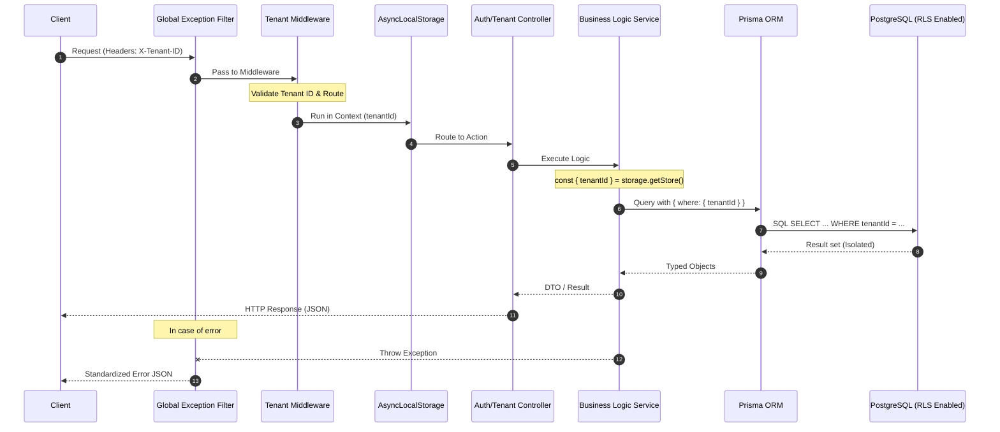

# Technical Flow: API Request & Multi-tenant Isolation

Tài liệu này mô tả chi tiết luồng đi của dữ liệu từ khi Client gửi yêu cầu cho đến khi nhận kết quả.

## Sơ đồ Sequence

## Giải thích các thành phần:

1.  **Middleware**: Đóng vai trò lớp bảo vệ và trích xuất danh tính Tenant.
2.  **AsyncLocalStorage**: Lưu trữ "trạng thái" của request hiện tại mà không làm bẩn các tham số hàm.
3.  **Isolation Strategy**: Chúng ta áp dụng **Logical Isolation** (Lọc ở tầng ứng dụng qua Prisma) và hướng tới **Physical Isolation** (RLS ở tầng DB).

---

_Tài liệu được khởi tạo tự động bởi Antigravity AI._
